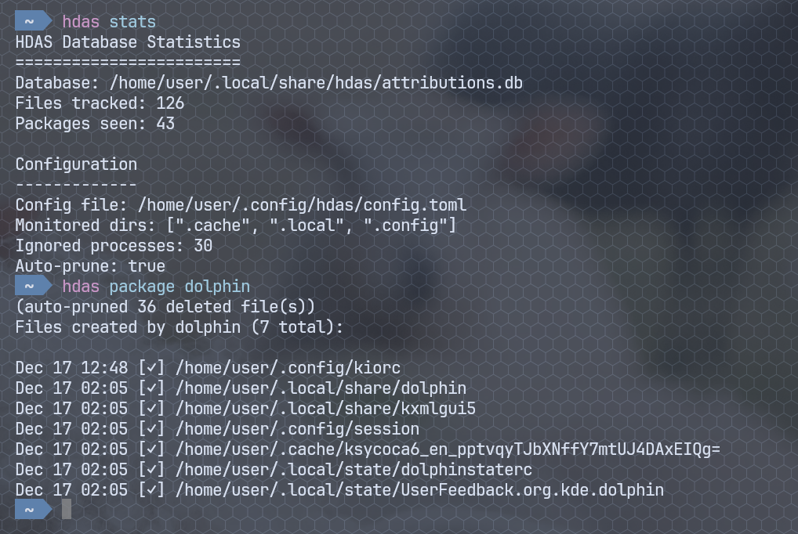

# HDAS - Home Directory Attribution System

Track which packages create files in your home directory (`~/.cache`, `~/.local`, `~/.config`) using eBPF. Find and clean up orphaned files left behind by uninstalled packages.



## The Problem

Linux applications scatter files across your home directory in `.cache`, `.local`, `.config`, and other dotfile directories. When you uninstall a package, these files often remain as cruft. Worse, the files and folders frequently don't match the package names, making manual cleanup tedious and error-prone.

## The Solution

HDAS uses eBPF to monitor file operations in real-time, attributing each file to the package that created it. When you uninstall a package, you can easily find and remove its leftover files.

## Features

- **eBPF-based monitoring** - Low overhead, kernel-level file access tracking
- **Process tree walking** - Accurately attributes files from child processes (browser threads, worker pools) to their parent application
- **Creator vs accessor tracking** - Distinguishes which package *created* a file from which package last *accessed* it
- **Configurable ignored processes** - Editors, pagers, and shells don't overwrite creator attribution
- **Orphan detection** - Find files from packages that are no longer installed
- **Auto-pruning** - Automatically removes deleted files from the database
- **Safe cleanup** - Delete files by package with confirmation prompts

## Requirements

- Linux kernel 5.8+ with eBPF support
- Arch Linux (uses `pacman` for package attribution)
- `clang` and `libbpf` for building
- Root privileges for monitoring

## Installation

### Building from source

```bash
# Install dependencies (Arch Linux)
sudo pacman -S clang libbpf rust

# Clone and build
git clone https://github.com/adelmonte/hdas.git
cd hdas
cargo build --release

# Optional: install to PATH
sudo cp target/release/hdas /usr/local/bin/
```

### Running as a Service

To run the monitor automatically at boot:

```bash
# Copy the service file
sudo cp hdas@.service /etc/systemd/system/

# Enable and start for your user (replace YOUR_USERNAME)
sudo systemctl enable --now hdas@YOUR_USERNAME

# Check status
sudo systemctl status hdas@YOUR_USERNAME

# View logs
sudo journalctl -u hdas@YOUR_USERNAME -f
```

## Usage

### Start Monitoring

```bash
sudo hdas monitor
```

The monitor runs in the foreground, capturing file operations and attributing them to packages. Output indicators:
- `[+]` Direct match - process owns the file
- `[^]` Parent match - attributed via ancestor process
- `[~]` Ignored process - accessor only, doesn't overwrite creator

Press `Ctrl+C` to stop.

### Query Commands

```bash
# Show database statistics
hdas stats

# List all tracked files
hdas list

# Search files by path pattern
hdas query mozilla
hdas query ".cache/spotify"

# Show files created by a specific package
hdas package firefox
hdas package spotify

# Find files from uninstalled packages
hdas orphans
```

### Cleanup Commands

```bash
# Remove files created by a package (with confirmation)
hdas clean firefox

# Skip confirmation prompt
hdas clean firefox -f

# Manually prune deleted files from database
hdas prune
```

### Configuration

```bash
# Show current configuration
hdas config

# Create default config file
hdas config init

# Edit configuration
hdas config edit
```

Configuration file: `~/.config/hdas/config.toml`

```toml
# Directories to monitor
monitored_dirs = [".cache", ".local", ".config"]

# Processes that don't overwrite creator attribution
ignored_processes = [
    "nvim", "vim", "code",     # editors
    "cat", "bat", "less",      # pagers
    "ls", "find", "rg",        # file tools
    "bash", "zsh", "fish",     # shells
]

# Packages to skip entirely (noisy apps like browsers)
ignored_packages = []

# How deep to track under monitored dirs
# 1 = app dir (e.g., ~/.cache/mozilla instead of ~/.cache/mozilla/firefox/cache2/...)
# Note: ~/.local/share, ~/.local/state, and ~/.local/lib automatically add +1 depth
# so with depth=1, you get ~/.local/share/appname instead of just ~/.local/share
tracking_depth = 1

# Auto-remove deleted files from DB on queries
auto_prune = true
```

## How It Works

### eBPF Monitoring

HDAS uses an eBPF (Extended Berkeley Packet Filter) program that attaches to the kernel's `sys_enter_openat` tracepoint. This captures every file open operation system-wide with minimal overhead.

The eBPF program runs in kernel space and:
1. Captures the PID, process name (comm), and filename for each `openat()` syscall
2. Performs initial path filtering in-kernel (only `.cache`, `.local`, `.config` paths)
3. Sends matching events to userspace via a perf ring buffer

### Package Resolution

When a file access event is received, HDAS needs to determine which package is responsible. This is done by:

1. Reading `/proc/<pid>/exe` to get the process's executable path
2. Querying `pacman -Qo <path>` to find which package owns that binary
3. If found, attribute the file to that package

Results are cached by binary path, so repeated file accesses from the same program only query pacman once.

**Example:** Process `firefox` (PID 1234) opens `~/.cache/mozilla/cookies.sqlite`
```
/proc/1234/exe → /usr/lib/firefox/firefox
pacman -Qo /usr/lib/firefox/firefox → "firefox 120.0-1"
Attribution: firefox
```

### Process Tree Walking

The simple approach fails for many real-world cases:

- **Thread pools** - Firefox uses `Isolated Web Co`, `StreamTrans`, `Cache2 I/O` threads
- **Forked children** - Many apps spawn short-lived worker processes
- **Race conditions** - Process exits before we can read `/proc/<pid>/exe`

HDAS solves this by walking up the process tree:

```
1. Try to resolve PID's own /proc/<pid>/exe → package
2. If that fails:
   a. Read /proc/<pid>/stat to get parent PID (PPID)
   b. Try to resolve parent's exe → package
   c. Repeat up the tree
3. Stop at:
   - PID 1 (init/systemd)
   - 10 levels deep (safety limit)
   - First successful package match
4. Return the package and which process matched
```

**Example:** Firefox content process writes to cache

```
Process: "Isolated Web Co" (PID 5678)
├── /proc/5678/exe → fails (sandboxed/forked)
├── PPID: 5432 (forkserver)
│   └── /proc/5432/exe → fails
├── PPID: 5013 (firefox)
│   └── /proc/5013/exe → /usr/lib/firefox-developer-edition/firefox
│   └── pacman -Qo → firefox-developer-edition
└── Attribution: firefox-developer-edition (via parent)
```

### Monitor Output

When running `sudo hdas monitor`, each file access is logged with an indicator:

| Indicator | Meaning | Example |
|-----------|---------|---------|
| `[+]` | **Direct match** - The process itself is owned by the package | `[+] firefox (firefox) -> ~/.cache/mozilla/...` |
| `[^]` | **Parent match** - Attributed via ancestor in process tree | `[^] firefox (Isolated Web Co) via firefox -> ~/.cache/mozilla/...` |
| `[~]` | **Ignored process** - In ignore list, only updates last_accessed | `[~] coreutils (cat) -> ~/.config/foo.conf` |

**Format:** `[indicator] package (process) [via parent] -> filepath`

### Creator vs Accessor Tracking

HDAS distinguishes between the process that *created* a file and processes that later *accessed* it.

**Problem:** If you `cat ~/.config/app/settings.conf`, the file gets attributed to `coreutils` instead of the app that created it.

**Solution:** The config file defines "ignored processes" - tools that read files but don't create them:

```toml
ignored_processes = [
    # Editors - you're editing, not creating
    "nvim", "vim", "code", "emacs",
    # Pagers - read-only access
    "cat", "bat", "less", "more", "head", "tail",
    # File tools - inspection only
    "ls", "find", "fd", "rg", "grep", "file", "stat",
    # Shells - reading configs
    "bash", "zsh", "fish",
]
```

**Behavior:**
- **Non-ignored process accesses file:**
  - If file is new: set `created_by` and `last_accessed_by` to this process/package
  - If file exists: update `last_accessed_by`, preserve `created_by`
- **Ignored process accesses file:**
  - If file is new: set `created_by` to "unknown", set `last_accessed_by` to this process
  - If file exists: only update `last_accessed_by`, never touch `created_by`

This ensures that opening a config in vim doesn't overwrite the original creator attribution.

### Database Schema

```sql
CREATE TABLE files (
    path TEXT PRIMARY KEY,

    -- Who created this file (first non-ignored process)
    created_by_package TEXT,
    created_by_process TEXT,
    created_at INTEGER,          -- Unix timestamp

    -- Who last accessed this file (any process)
    last_accessed_by_package TEXT,
    last_accessed_by_process TEXT,
    last_accessed_at INTEGER     -- Unix timestamp
);

CREATE INDEX idx_package ON files(created_by_package);
CREATE INDEX idx_last_package ON files(last_accessed_by_package);
```

**Migration:** When upgrading from an older version, existing data is migrated automatically. The old `package`/`process` fields are copied to both `created_by_*` and `last_accessed_by_*` columns.

### Auto-Pruning

Files get deleted all the time (cache expiry, manual cleanup, app behavior). By default, HDAS automatically removes database entries for files that no longer exist when you run any query command.

```bash
$ hdas list
(auto-pruned 76 deleted file(s))
Cataloged files (137 total):
...
```

This can be disabled in config:

```toml
auto_prune = false
```

Or run manually:

```bash
hdas prune
```

## Limitations

- **Arch Linux only** - Package attribution uses `pacman`. Contributions for other distros welcome.
- **Monitoring must be running** - Only tracks files accessed while the monitor is active
- **Some "unknown" attributions** - Processes not in pacman's database (AUR binaries in `~/.local/bin`, scripts, etc.) show as "unknown"
- **No retroactive attribution** - Files created before monitoring started won't be attributed

## Project Structure

```
hdas/
├── src/
│   ├── main.rs      # CLI entry point
│   ├── monitor.rs   # eBPF event processing, process tree walking
│   ├── db.rs        # SQLite database, schema migrations
│   ├── query.rs     # Query and cleanup commands
│   └── config.rs    # Configuration loading
├── bpf/
│   └── monitor.bpf.c  # eBPF kernel program
├── build.rs         # Compiles eBPF code at build time
├── hdas@.service    # Systemd service template
└── Cargo.toml
```

## License

GPL-3.0 - See [LICENSE](LICENSE) for details.
