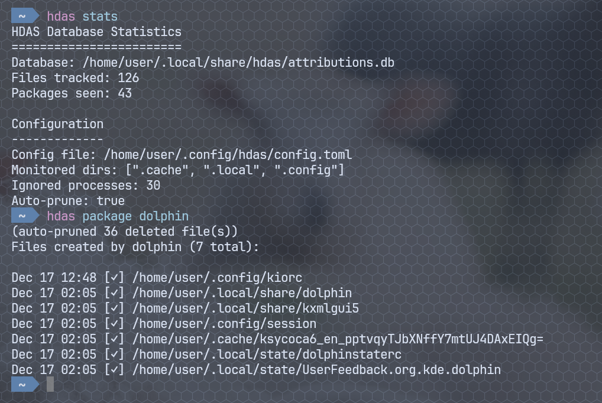

# HDAS - Home Directory Attribution System

Track which packages create files in your home directory. Uses eBPF to monitor file operations in real-time, so when you uninstall a package you can find and clean up everything it left behind.



## The Problem

Linux applications scatter files across `~/.cache`, `~/.local`, `~/.config`, `/etc/`, and other directories. When you uninstall a package, these files remain. The files and folders frequently don't match the package names, making manual cleanup tedious and error-prone.

## The Solution

HDAS attaches an eBPF program to the kernel's `openat` syscall to trace file operations in real-time with minimal overhead. Each file access is resolved to its originating package through process tree walking and package manager queries. The result is a database mapping every tracked file to the package that created it — queryable, cleanable, and exportable as JSON.

## Features

- **eBPF-based monitoring** — Kernel-level file access tracking with negligible overhead
- **Process tree walking** — Attributes files from child processes (browser threads, worker pools) to their parent package
- **Creator vs accessor tracking** — Distinguishes which package *created* a file from which *last accessed* it
- **Multi-distro support** — Auto-detects pacman, dpkg, rpm, xbps, and apk at runtime
- **Configurable directories** — Monitor home dotdirs and absolute paths like `/etc/` with per-directory depth settings
- **Orphan detection** — Find files from packages that are no longer installed
- **Safe cleanup** — Delete files by package with dry-run and confirmation prompts, including symlink-aware deletion
- **JSON output** — `--json` flag on all query and cleanup commands for scripting
- **Colored terminal output** — Automatically disabled when piped
- **Shell completions** — Bash, Zsh, Fish, Elvish, PowerShell
- **Man page generation** — Built-in via `hdas man-page`

## Requirements

- Linux kernel 5.8+ with eBPF support
- A supported package manager: pacman, dpkg, rpm, xbps, or apk
- `clang` and `libbpf` for building
- Root privileges for monitoring

## Installation

### AUR (Arch Linux)

```bash
# Stable release
yay -S hdas

# Or latest git
yay -S hdas-git
```

### Building from source

```bash
# Install build dependencies (example for Arch)
sudo pacman -S clang libbpf rust

# Clone and build
git clone https://github.com/adelmonte/hdas.git
cd hdas
cargo build --release

# Install binary and service
sudo install -Dm755 target/release/hdas /usr/bin/hdas
sudo install -Dm644 hdas@.service /usr/lib/systemd/system/hdas@.service
```

### Shell completions and man page

```bash
# Completions (pick your shell)
hdas completions bash > /usr/share/bash-completion/completions/hdas
hdas completions zsh  > /usr/share/zsh/site-functions/_hdas
hdas completions fish > ~/.config/fish/completions/hdas.fish

# Man page
hdas man-page > /usr/share/man/man1/hdas.1
```

### Running as a service

```bash
sudo systemctl enable --now hdas@YOUR_USERNAME

# Check status
hdas status

# View logs
sudo journalctl -u hdas@YOUR_USERNAME -f
```

## Usage

### Querying

```bash
# List all tracked files
hdas list

# Show files created by a specific package
hdas package firefox

# Show files under a directory
hdas dir ~/.cache
hdas dir /etc/

# Search files by path pattern
hdas query mozilla

# Find files from uninstalled packages
hdas orphans
```

### Cleanup

```bash
# Delete files created by a package (with confirmation)
hdas clean firefox

# Dry-run — show what would be deleted
hdas clean firefox -n

# Skip confirmation
hdas clean firefox -f

# Delete all files from uninstalled packages
hdas clean-orphans

# Remove stale database records:
#   - files that no longer exist on disk
#   - records under excluded_paths
#   - records from ignored_packages
hdas prune
```

### Info

```bash
# Service, database, and config overview
hdas status

# Detailed database and configuration statistics
hdas stats

# See how a path gets tracked (depth truncation)
hdas explain ~/.cache/mozilla/firefox/something
```

### Configuration

```bash
# Show current configuration
hdas config

# Create default config file
hdas config init

# Edit in $EDITOR
hdas config edit

# Check for errors and warnings
hdas config validate
```

### JSON output

All query and cleanup commands support `--json` for scripting:

```bash
hdas list --json
hdas stats --json
hdas orphans --json
hdas status --json
hdas clean firefox -n --json
hdas config validate --json
```

### Monitor

```bash
# Start the eBPF monitor (requires root)
sudo hdas monitor
```

Output indicators:
- `[+]` Direct match — process owns the file
- `[^]` Parent match — attributed via ancestor process
- `[~]` Ignored process — accessor only, doesn't overwrite creator

### Configuration file

Location: `~/.config/hdas/config.toml`

> **Important:** In TOML, all top-level keys must appear *before* any `[[array]]` sections.
> Place all settings above the `[[monitored_dirs]]` entries.

```toml
# Processes that don't overwrite creator attribution
ignored_processes = [
    "nvim", "vim", "code",     # editors
    "cat", "bat", "less",      # pagers
    "ls", "find", "rg",        # file tools
    "bash", "zsh", "fish",     # shells
]

# Packages to skip entirely — events are never recorded, and
# existing records are retroactively pruned from the database
ignored_packages = []

# Paths to exclude from monitoring even if under a monitored_dir
# Existing records under these paths are retroactively pruned
excluded_paths = [
    "/etc/ssl/",              # TLS cert reads — very noisy
    "/etc/ca-certificates/",  # same as above
]

# Default depth for dirs without explicit depth setting
# 1 = app dir (e.g., ~/.cache/mozilla)
# 0 = track full paths (useful for /etc/)
# Note: ~/.local/share, ~/.local/state, ~/.local/lib automatically add +1 depth
tracking_depth = 1

# Auto-remove stale records (deleted files, excluded paths,
# ignored packages) from DB on queries
auto_prune = true

# Directories to monitor with per-directory depth settings
#
# Depth controls how much of the path is kept after the monitored dir:
#   depth=1: ~/.cache/mozilla/firefox/... -> ~/.cache/mozilla
#   depth=2: ~/.cache/mozilla/firefox/... -> ~/.cache/mozilla/firefox
#   depth=0: full path, no truncation
#
# Use `hdas explain <path>` to see how a path would be tracked.

[[monitored_dirs]]
path = ".cache"

[[monitored_dirs]]
path = ".local"

[[monitored_dirs]]
path = ".config"

[[monitored_dirs]]
path = "/etc/"
depth = 0  # track full paths
```

## Examples

### Find and clean up after uninstalling a package

```bash
$ sudo pacman -R discord

$ hdas package discord
Files created by discord (3 total):

Feb 18 22:11 [✓] /home/user/.cache/discord
Feb 18 22:11 [✓] /home/user/.config/discord
Feb 18 22:11 [✓] /home/user/.local/share/discord

$ hdas clean discord
Will delete 3 file(s), 0 director(ies), 0 symlink(s) [142.8M]:
  [142.5M] [dir ] /home/user/.cache/discord
  [ 256.0K] [dir ] /home/user/.config/discord
  [ 64.0K] [dir ] /home/user/.local/share/discord

Proceed? [y/N]: y
```

### Bulk-clean all orphaned packages at once

```bash
$ hdas orphans
Files from uninstalled packages:

signal-desktop (2 file(s)):
  /home/user/.config/Signal
  /home/user/.cache/Signal

telegram-desktop (1 file(s)):
  /home/user/.config/telegram

$ hdas clean-orphans
```

### Investigate what a package left behind

```bash
$ hdas query mozilla
Found 4 file(s) matching 'mozilla':

Mar 01 14:22 [✓] /home/user/.cache/mozilla
Mar 01 14:22 [✓] /home/user/.config/mozilla
Feb 28 09:15 [✗] /home/user/.local/share/mozilla (deleted)
```

### Scripting with JSON output

```bash
# Get all orphaned packages as JSON
hdas orphans --json | jq '.[].package'

# Total size of files from a package
hdas clean firefox -n --json | jq '.total_size'

# Pipe package file list into other tools
hdas package steam --json | jq -r '.[].path'
```

### Silence noisy packages and paths

```toml
# In ~/.config/hdas/config.toml — place ABOVE [[monitored_dirs]]

# Skip recording events from noisy packages entirely
ignored_packages = ["electron", "nwjs"]

# Exclude high-traffic paths that clutter the database
excluded_paths = [
    "/etc/ssl/",
    "/etc/ca-certificates/",
    "/etc/ananicy.d/",
]
```

Existing records from ignored packages and excluded paths are automatically
cleaned up by `hdas prune` or on the next query when `auto_prune = true`.

## How It Works

### eBPF monitoring

HDAS attaches an eBPF program to the kernel's `sys_enter_openat` tracepoint. This captures every file open operation system-wide with minimal overhead.

The eBPF program runs in kernel space and:
1. Captures the PID, process name, and filename for each `openat()` syscall
2. Performs initial path filtering in-kernel for configured directories
3. Sends matching events to userspace via a perf ring buffer

### Package resolution

When a file access event is received, HDAS determines the responsible package by:

1. Reading `/proc/<pid>/exe` to get the executable path
2. Querying the system package manager to find which package owns that binary
3. Caching results by binary path so repeated accesses don't re-query

The package manager is auto-detected at startup (pacman, dpkg, rpm, xbps, or apk).

**Example:** Firefox opens `~/.cache/mozilla/cookies.sqlite`
```
/proc/1234/exe → /usr/lib/firefox/firefox
pacman -Qo /usr/lib/firefox/firefox → "firefox"
Attribution: firefox
```

### Process tree walking

Simple PID-to-package resolution fails for many real-world cases:

- **Thread pools** — Firefox uses `Isolated Web Co`, `StreamTrans`, `Cache2 I/O` threads
- **Forked children** — Many apps spawn short-lived worker processes
- **Race conditions** — Process exits before we can read `/proc/<pid>/exe`

HDAS solves this by walking up the process tree:

```
1. Try to resolve PID's own /proc/<pid>/exe → package
2. If that fails, walk up via PPID:
   a. Read /proc/<pid>/stat to get parent PID
   b. Try to resolve parent's exe → package
   c. Repeat (up to 10 levels, stopping at PID 1)
3. Return the first successful package match
```

### Creator vs accessor tracking

HDAS distinguishes between the process that *created* a file and processes that later *accessed* it.

**Problem:** If you `cat ~/.config/app/settings.conf`, the file gets attributed to `coreutils` instead of the app that created it.

**Solution:** Configured "ignored processes" (editors, pagers, shells) only update the `last_accessed_by` field, never overwriting `created_by`. This ensures that opening a config in vim doesn't lose the original creator attribution.

### Database schema

```sql
CREATE TABLE files (
    path TEXT PRIMARY KEY,
    created_by_package TEXT,
    created_by_process TEXT,
    created_at INTEGER,
    last_accessed_by_package TEXT,
    last_accessed_by_process TEXT,
    last_accessed_at INTEGER
);
```

Existing databases from older versions are migrated automatically on first open.

## Limitations

- **Monitoring must be running** — Only tracks files accessed while the monitor is active
- **Some "unknown" attributions** — Processes not in the package manager's database (AUR binaries, scripts in `~/.local/bin`, etc.) show as "unknown"
- **No retroactive attribution** — Files created before monitoring started won't be attributed

## Project Structure

```
hdas/
├── src/
│   ├── main.rs      # CLI, subcommand dispatch
│   ├── monitor.rs   # eBPF event processing, process tree walking
│   ├── db.rs        # SQLite database, schema migrations
│   ├── query.rs     # Query commands, JSON/colored output
│   ├── cleanup.rs   # File deletion, symlink handling
│   ├── config.rs    # Configuration loading and defaults
│   └── pkgmgr.rs    # Package manager abstraction (pacman, dpkg, rpm, xbps, apk)
├── bpf/
│   └── monitor.bpf.c  # eBPF kernel program
├── build.rs         # Compiles eBPF code at build time
├── hdas@.service    # Systemd service template
└── Cargo.toml
```

## License

GPL-3.0 — See [LICENSE](LICENSE) for details.
